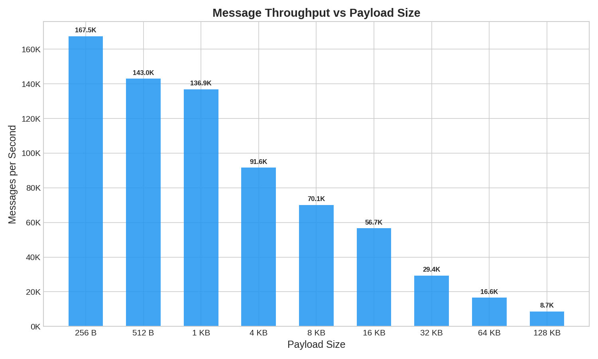
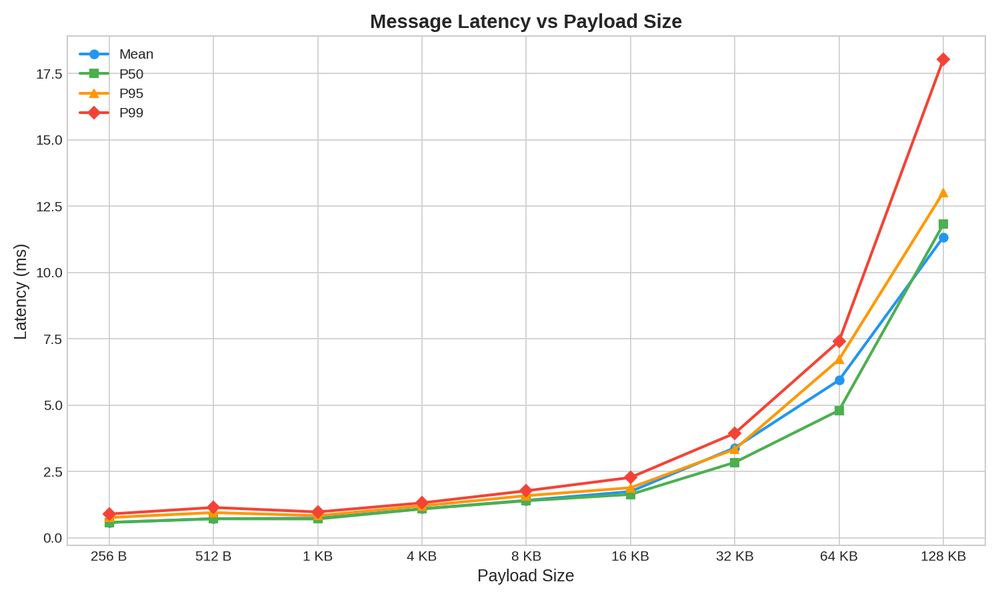
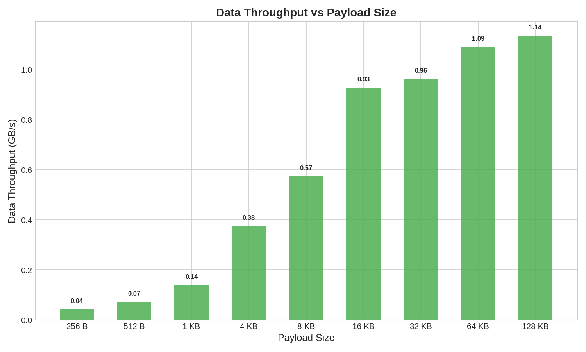

# Benchmark Results

This document contains performance benchmarks for Narwhal's pub/sub messaging system. All benchmarks were conducted using the `narwhal-bench` tool included in the project.

## Test Environment

### Hardware

- **Model**: MacBook Pro, M1, 2020
- **Memory**: 16 GB

### Configuration

- **Build Configuration**: Release mode (`--release`)
- **Server**: Local Narwhal instance (127.0.0.1:22622)
- **Test Duration**: 60 seconds per run
- **Producers**: 1
- **Consumers**: 1
- **Channels**: 1
- **Worker Threads**: 8

## Benchmark Tool

The benchmark tool is located in the `crates/benchmark` directory and can be built and run as follows:

```bash
# Build the benchmark tool
cargo build --release -p narwhal-benchmark

# Run a benchmark
./target/release/narwhal-bench \
  --server 127.0.0.1:22622 \
  --producers 1 \
  --consumers 1 \
  --duration 1m \
  --max-payload-size 256
```

### Available Options

- `-s, --server <ADDR>`: Server address to connect to (default: 127.0.0.1:22622)
- `-p, --producers <N>`: Number of producer clients (default: 1)
- `-c, --consumers <N>`: Number of consumer clients (default: 10)
- `-n, --channels <N>`: Number of channels to create (default: 1)
- `-d, --duration <TIME>`: Duration to run the benchmark (supports: 30s, 5m, 1h)
- `--max-payload-size <BYTES>`: Maximum size of message payload in bytes (default: 16384)
- `-w, --worker-threads <N>`: Number of worker threads to use (default: 0, auto-detect)

## Results

### Performance Overview Table

All benchmarks were run with 1 producer and 1 consumer for 60 seconds.

| Payload Size | Throughput (msg/s) | Data Throughput | Mean Latency | P50 | P95 | P99 | Total Messages |
|--------------|-------------------:|----------------:|-------------:|----:|----:|----:|---------------:|
| 256 B        | 65,353            | 15.9 MB/s       | 1.01ms       | 1ms | 2ms | 2ms | 3,921,180      |
| 512 B        | 64,505            | 31.5 MB/s       | 0.99ms       | 1ms | 2ms | 2ms | 3,872,423      |
| 1 KB         | 62,770            | 61.3 MB/s       | 1.03ms       | 1ms | 2ms | 2ms | 3,768,233      |
| 4 KB         | 58,883            | 229.2 MB/s      | 1.13ms       | 1ms | 2ms | 3ms | 3,534,904      |
| 8 KB         | 51,108            | 400.2 MB/s      | 1.39ms       | 1ms | 2ms | 3ms | 3,068,092      |
| 16 KB        | 44,244            | 690.7 MB/s      | 1.69ms       | 2ms | 3ms | 4ms | 2,656,080      |
| 32 KB        | 40,618            | 1.24 GB/s       | 1.89ms       | 2ms | 3ms | 4ms | 2,438,397      |
| 64 KB        | 32,184            | 1.97 GB/s       | 2.53ms       | 2ms | 4ms | 5ms | 1,932,054      |
| 128 KB       | 17,405            | 2.17 GB/s       | 5.20ms       | 5ms | 8ms | 9ms | 1,045,028      |

### Visual Performance Analysis

#### Message Throughput



This graph shows how message throughput (messages per second) varies with payload size. Peak performance is achieved with small to medium payloads (256B-512B), delivering over 65,000 messages per second.

#### Latency



This graph compares mean and P99 latency across different payload sizes. Latency scales gradually with payload size, with P99 latency remaining under 10ms even at 128KB payloads.

#### Data Throughput (Bandwidth)



This graph illustrates the actual data throughput in MB/s. While message rate decreases with larger payloads, the overall bandwidth increases significantly, reaching over 2GB/s with 128KB payloads.

### Key Observations

1. **Peak Throughput**: Achieved with 512-byte payloads at ~64,505 messages/second
2. **Consistent Low Latency**: Sub-millisecond mean latency maintained across small to medium payload sizes (512B - 1KB)
3. **Payload Size Impact**: As payload size increases, throughput decreases and latency increases, which is expected due to larger data transfers
4. **Latency Stability**: P99 latency remains very low (2-9ms) across all payload sizes, indicating consistent performance
5. **Zero Errors**: All benchmarks completed without any message loss or errors

## Running Your Own Benchmarks

To run your own benchmarks:

1. **Start the Narwhal server** with appropriate configuration:
   ```bash
   cargo run --bin narwhal --release -- --config examples/config/c2s-benchmark.toml
   ```

2. **Run the benchmark tool** with your desired parameters:
   ```bash
   ./target/release/narwhal-bench \
     --producers <N> \
     --consumers <M> \
     --duration <TIME> \
     --max-payload-size <BYTES>
   ```

3. **Consider these factors** when interpreting results:
   - Hardware specifications (CPU, memory, network)
   - Server configuration (rate limits, buffer sizes)
   - Network conditions (local vs. remote, latency)
   - Concurrent load and system resources

## Notes

- All benchmarks were run on a local machine with the server and client on the same host
- Network latency in production environments will add to the observed latency values
- The benchmark tool generates random payloads up to the specified maximum size
- Server configuration used the `c2s-benchmark.toml` profile with rate limiting disabled
- Results may vary based on hardware, OS, and system load
